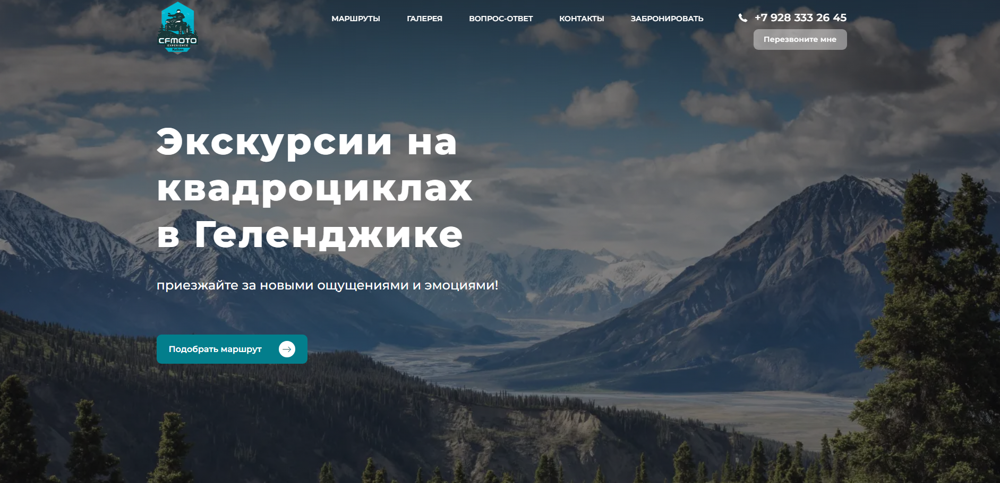

# [**Travel**](https://stanislavkhurtov.github.io/travel3/)

The Travel website is an attractive and
modern resource for all travel enthusiasts.
Responsive design, modern technology, eye-catching
animations and a user-friendly experience make this site an ideal source
of information and inspiration for anyone who
dreams of new adventures and discoveries.

## Key Skills:

- Knowledge of JavaScript: Ability to add interactivity to web pages, handle events, create animations, work
  with AJAX and basic functionality.

- Adaptive design and mobile layout: Experience with media queries, CSS frameworks and other tools for
  creating responsive and mobile design.

- Experience with CSS preprocessors: Knowledge and use of preprocessors such as Sass or Less to simplify CSS code
  development and maintenance.

- Cross-browser compatibility: Ability to create web pages that work equally well across browsers (Chrome, Firefox,
  Safari, etc.) and platforms.

- Performance Optimization: Skills in optimizing page load, compressing and optimizing images, minifying and building
  CSS and JavaScript files, caching and other techniques to improve site performance.

- Development Tools: Experience with code editors (e.g. Visual Studio Code, WebStorm), version control systems (e.g. Git), and
  browser inspectors (e.g. Chrome DevTools) for efficient development and debugging.

- Proficiency with design files and designer tools: Experience working with design files (e.g. PSD, Sketch, Figma) and
  the ability to translate design layouts into code with high fidelity.

- Communication Skills: Ability to communicate effectively with designers, developers and other project stakeholders to
  understand requirements and deliver results.

## Technologies

- JavaScript
- HTML,SCSS
- GSAP Animation
- Webpack

## Installation and launch of the project

- Clone the repository to your local computer.
- Install depending on the command npm install.
- Start the project by running npm start.
- Open your web browser and check the address http://localhost:3000.

## Utilization

### [**Travel**](https://stanislavkhurtov.github.io/travel3/)

## Contribution to the project

We welcome input from the community and would be happy to accept your suggestions for improving the project. If you have
any ideas, bug fixes or new features, please create a pull request or let us know.

## Contacts

If you have any questions or require additional information, please contact us using the following contact information:

Email: [skhurtov.work@yandex.ru](skhurtov.work@yandex.ru)

Thank you for your interest in our project!
